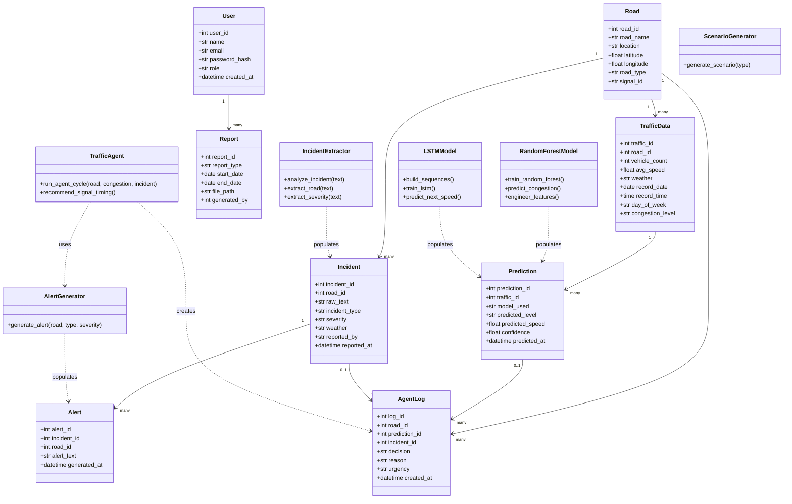

# Class Diagram

**Explanation:** The top section shows the persistent entity classes (mirroring the database
tables). The bottom section shows the key service/logic classes (one per AI module) and how
they relate to those entities — e.g. `TrafficAgent` uses `AlertGenerator` and creates `AgentLog`
records, `RandomForestModel` produces `Prediction` records.
