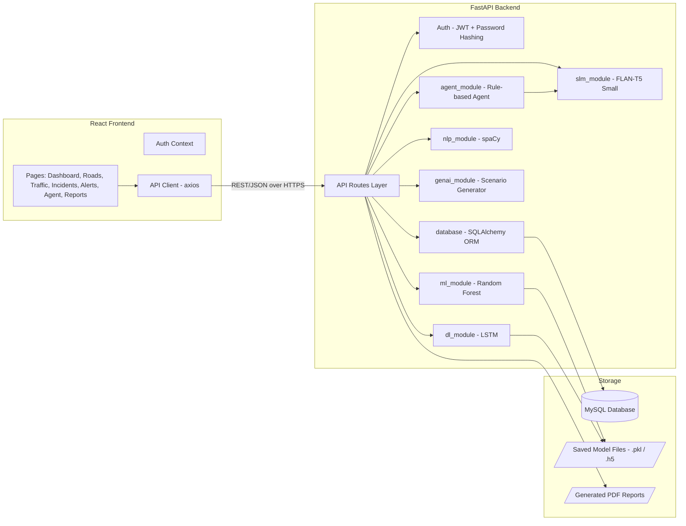

# Component Diagram

**Explanation:** The frontend only ever talks to the API Routes layer. Within the backend, each
AI module is a separate component with a narrow responsibility; the Agent module is the only one
that calls another AI module directly (SLM, for alert text). All persistent state lives in
MySQL, with trained model binaries and generated PDF reports stored as files on disk.
