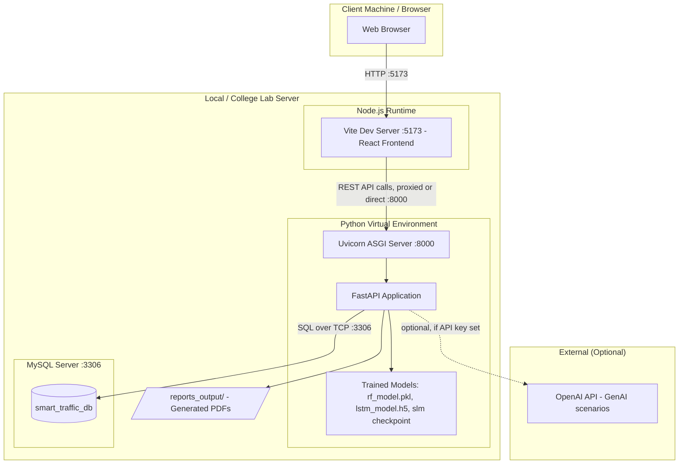

# Deployment Diagram

**Explanation:** For a college demo, everything typically runs on a single machine: the Vite dev
server serves the React app, Uvicorn serves the FastAPI backend, and MySQL runs locally. The only
external dependency is the OpenAI API, which is entirely optional — without an API key, the
GenAI module falls back to its offline procedural generator, so the whole system can run with
zero internet access (useful for a viva in a room without reliable Wi-Fi).

For a more production-like deployment, each box (frontend build served via Nginx, backend
container, MySQL container) could be containerized separately and orchestrated with Docker
Compose — left as a documented future-scope item rather than implemented, to keep the submission
focused.
