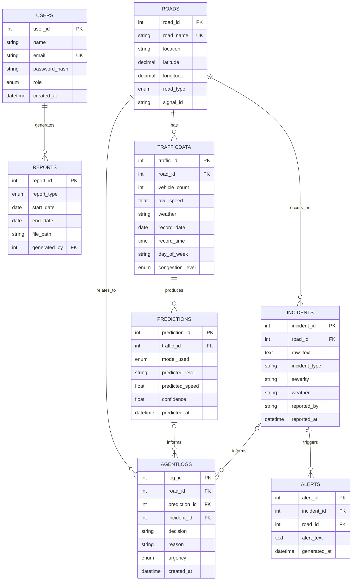

# ER Diagram

**Explanation:** `Roads` is the central entity, referenced by `TrafficData`, `Incidents`, and
`AgentLogs`. `TrafficData` produces `Predictions`. `Incidents` trigger `Alerts`. `AgentLogs` ties
together a road, an optional prediction, and an optional incident, reflecting the agent's
"perceive both, then decide" workflow. All foreign keys to `Roads`/`Predictions`/`Incidents` from
`AgentLogs`/`Alerts` are nullable, since an agent decision or alert might stem from only a
prediction, only an incident, or both.
