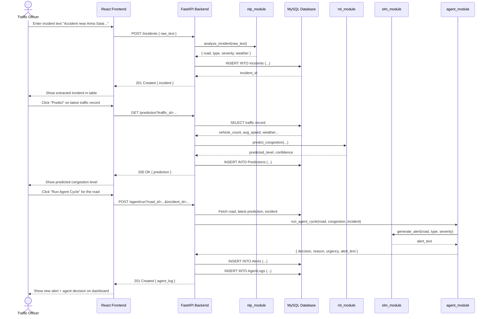

# Sequence Diagram — Full Incident-to-Decision Flow

**Explanation:** This trace shows the most representative end-to-end flow in the system: an
officer submits an incident, the NLP module structures it, the ML module predicts congestion
for the same road, and finally the Agentic AI module ties both together — generating an alert
via the SLM module and logging a signal-timing recommendation — all visible back on the
dashboard in real time.
