# Use Case Diagram

```mermaid
graph TB
    Admin((Admin))
    Officer((Traffic Officer))

    subgraph Smart City Traffic Management System
        UC1[Login / Logout]
        UC2[Manage Roads - CRUD]
        UC3[Manage Traffic Data - CRUD + CSV Upload/Download]
        UC4[Train ML Model]
        UC5[View Congestion Predictions]
        UC6[View Traffic Forecast - LSTM]
        UC7[Submit Incident Report]
        UC8[View Extracted Incident Data]
        UC9[Generate Commuter Alert]
        UC10[Generate GenAI Scenario]
        UC11[Run Agentic AI Decision Cycle]
        UC12[View Agent Decision Log]
        UC13[Generate / Download Reports]
        UC14[Register New User]
    end

    Admin --> UC1
    Admin --> UC2
    Admin --> UC3
    Admin --> UC4
    Admin --> UC5
    Admin --> UC6
    Admin --> UC7
    Admin --> UC8
    Admin --> UC9
    Admin --> UC10
    Admin --> UC11
    Admin --> UC12
    Admin --> UC13
    Admin --> UC14

    Officer --> UC1
    Officer --> UC3
    Officer --> UC5
    Officer --> UC7
    Officer --> UC8
    Officer --> UC9
    Officer --> UC10
    Officer --> UC11
    Officer --> UC12
    Officer --> UC13
```

**Explanation:** Both Admin and Traffic Officer can log in and use the core operational features
(traffic data, incidents, alerts, scenarios, agent decisions, reports). Admin-only actions
(road management, model training, user registration) reflect typical real-world separation
between configuration/maintenance tasks and day-to-day operational tasks.
